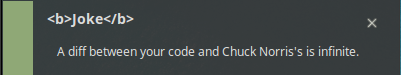
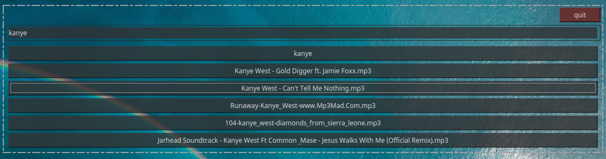
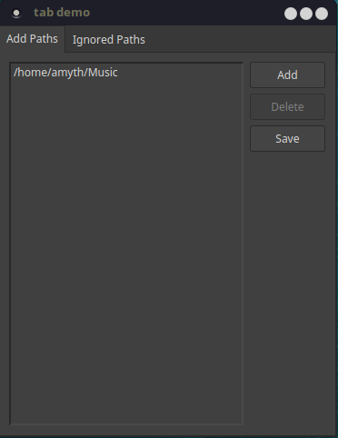
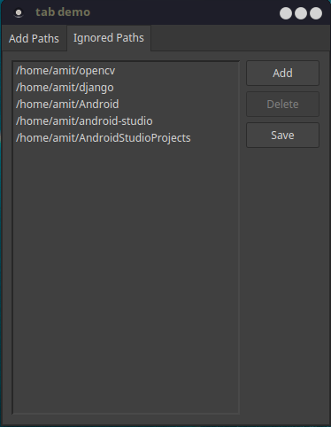

#### Easier file management using separately stored metadata
1. Menu contains `Joke`,`Search`,`Preferences`,`Update Database` and `Quit`.
2. `Joke` brings joke using joke api and displays as notification.
	
3. `Search` opens desklet where you can search.
	
4. `Preferences` gives access about what directories to add to database and what to ignore.
	
    
5. `Update Database` updates database.
6. `Quit` will stop application from running in background.
7. Selecting an item after search will open that document in default application using xdg-open.

